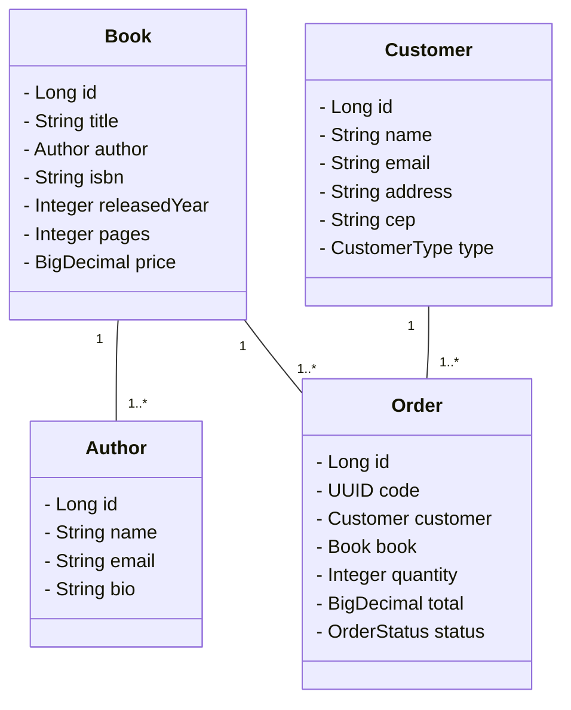

# Bookstore Management API

This is a simple Spring Boot project demonstrating the use of design patterns in a bookstore management system.
This is an activity for a course on Development with Spring.

## Main Technologies

- **Java 21**: Programming language.
- **Spring Boot 3**: Framework for building Spring based applications quickly.
- **Spring Data JPA**: Simplifies data access with ORM.
- **H2 Database**: In-memory database for development.
- **OpenAPI**: API documentation.
- **JUnit 5**: Testing framework.

## Features

- Manage books, customers, authors, and place orders.
- Apply different discounts based on customer type (Regular, Premium, VIP).

## Class Diagram

## Design Patterns Used

- Strategy Pattern: Applies different discount strategies based on customer type.
- Singleton Pattern: Ensures single instances of services managed by spring.
- Facade Pattern: Simplifies interactions with subsystems on OrderService.
